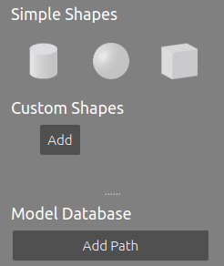

# **Gazebo Project**

This Gazebo project is a simple model created using the tools within Gazebo. Gazebo is a simulation tool associated with Robot Operating System (ROS) to simulate a model of a robot interacting in an environment. It's ROS capabilities allow for control of the simulated robots, as well as produce simulated sensor data, similar to that of real sensors such as GPS, LiDAR, radar, cameras, and more.


### Model Editor
The model editor allows for making interactive object in the simulation. You can create shapes, give them specific attributes, and link them together in different ways. You can switch to the model editor by clicking the `Edit` dropdown and selecting `Model Editor` or by using the shortcut key `Ctrl + M`.

The model editor menu can be seen below:



Models can have their visual and collision geometries set. An example of a created model using just the simple shapes and link can be seen below:


It is also possible to import 3D models generated in SolidWorks using the [SolidWorks URDF Exporter](http://wiki.ros.org/sw_urdf_exporter) (Note: The last fully supported version is for SolidWorks 2017, but some modifications can be made to have it work for future versions).

### Building Editor
The building editor can be used to simulate simple walls, door ways, windows, and stairs. This editor is generally used to create basic rooms similar to that which the robot may be in. You can switch to the building editor by clicking the `Edit` dropdown and selecting `Building Editor` or by using the shortcut key `Ctrl + B`.

The building editor menu can be seen below:


You can draw the 2D representation of the building in the upper panel, and see the results in your world on the second panel below. Below is an example:


### Creating Custom Scripts
Scripts can also be used to augment your gazebo experience. This project contains a simple script which provide a simple startup message when you run the gazebo world:


### Running The World
To run the gazebo world, you must have Gazebo installed and run the following in a terminal:


```bash
cd /path/to/Gazebo_Workspace/build  #Substitute with your own path to directory
cmake ../
make
export GAZEBO_PLUGIN_PATH=${GAZEBO_PLUGIN_PATH}:/path/to/Gazebo_Workspace/build
gazebo ../world/Kanaloa_Lab_World
```
